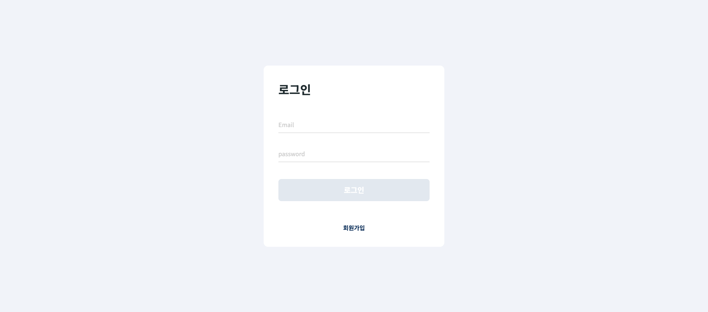
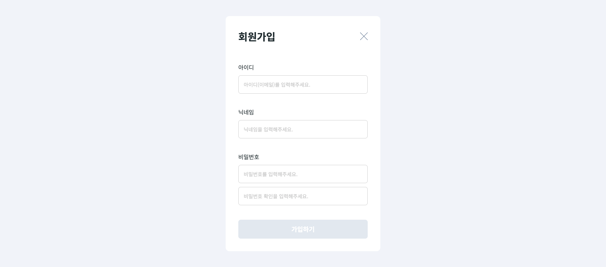
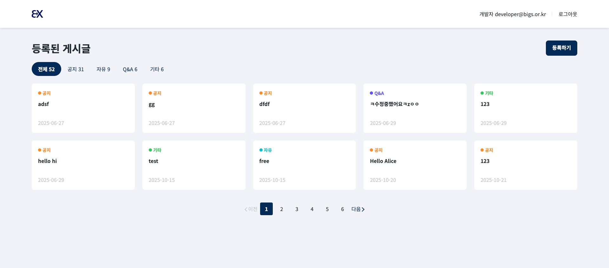
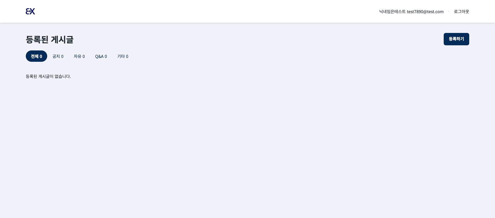
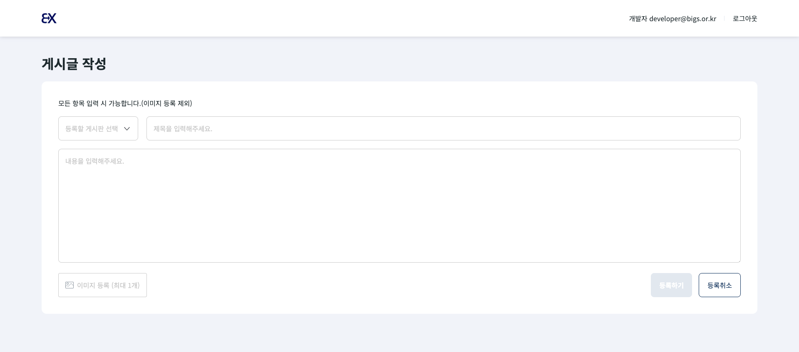
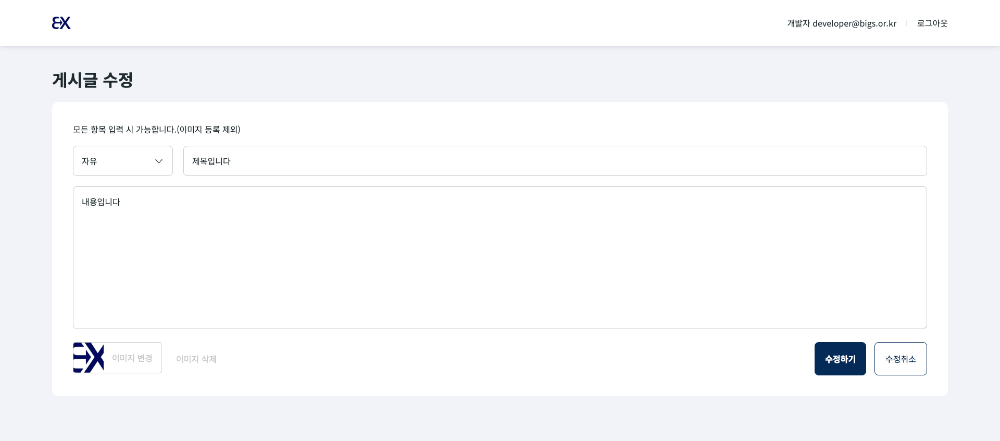
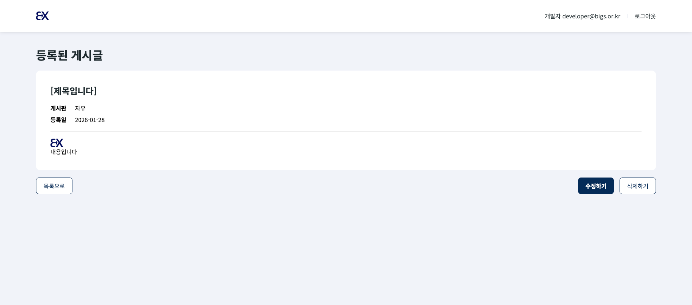
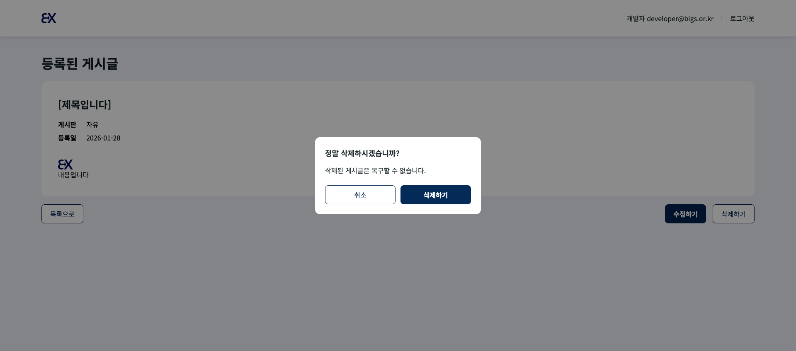
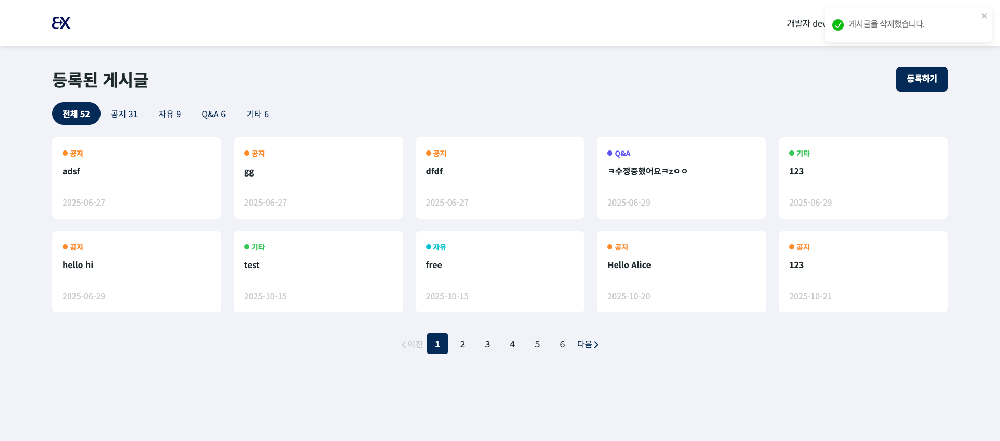

# 빅스페이먼츠 프론트엔드 과제

## ✨ 프로젝트 소개

React + TypeScript + Vite + Zustand 기반 게시판 프로젝트입니다.  
회원가입/로그인, 게시글 CRUD, 카테고리별 조회, 반응형 UI 기능을 제공합니다.

## ⚡ 주요 기능

- 사용자 회원가입, 로그인, 로그인한 사용자 정보 표시(아이디, 이름)
- 게시판 : 글 등록, 조회(페이지네이션), 수정, 삭제
- 탭 메뉴 : 게시글 카테고리별 조회
- 상태 관리 : 인증 상태는 Zustand를 사용, 토큰은 localStorage에 persist
- 반응형 UI 지원

## 🎮 프로젝트 실행 방법

1. 프로젝트 clone

```bash
  git clone https://github.com/pha1155/task-bix.git
```

2. 패키지 설치

```bash
  npm install
```

3. 프로젝트 실행

```bash
  npm run dev
```

## 🧱 환경 변수 설정 (.env example)

1. 프로젝트 루트에 `.env` 파일 생성
2. `.env.example` 내용을 복사하여 `.env` 파일로 붙여넣기

```bash
cp .env.example .env
```

## 📸 실행 화면

로그인 페이지


회원가입 페이지


Home 게시글 목록 페이지


게시글 목록 - 빈 상태


글쓰기 페이지


글 수정 페이지


글 상세 페이지


글 삭제 팝업


Toast


## 📁 폴더 구조

```
💚 src
 ┣ 📁 api           # 서버 API
 ┣ 📁 assets        # 이미지, 아이콘
 ┣ ⭐️ components    # 공통 컴포넌트
 ┣ 📁 constants     # 게시판 카테고리 등 앱 전역 상수 및 헬퍼 함수
 ┣ 📁 hooks         # 커스텀 훅
 ┣ 📁 layout        # 페이지 레이아웃
 ┣ 📚 pages         # 페이지 단위 컴포넌트
 ┣ 📁 routes        # 라우트
 ┣ 🧰 store         # 인증(Auth) 상태 관리용 Zustand 스토어
 ┣ 📁 types         # 타입 정의
 ┣ 📁 utils         # 유틸리티 함수
 ┣ 📄 App.tsx
 ┗ 📄 main.tsx
```

## 🔨 기술 스택

<h3>Frontend</h3>
<div align="left">
  
  
  
</div>

<h3>Build</h3>
<div align="left">
  
</div>

<h3>Styling</h3>
<div align="left">
  
</div>
